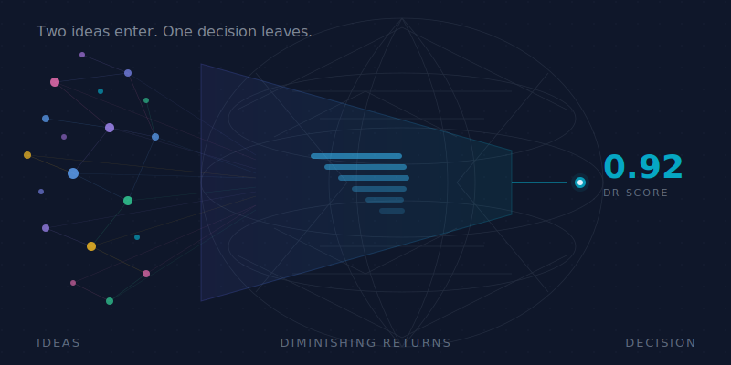

# Diminishing Returns

<p align="center">
  
</p>

<details>
<summary>ASCII fallback</summary>

```text
   TWO IDEAS ENTER
        │
        ▼
    ┌─────────┐
    │  DR PIT  │   (Thunderdome mode)
    └────┬────┘
         ▼
   ONE DECISION LEAVES
```

</details>

A small utility for measuring **diminishing returns** in multi-agent / multi-LLM conversations.

This is **not "confidence."** It's a stop/ship signal: *are we still producing novel, decision-relevant information?*

---

## 📏 What it measures (v0.1)

A weighted score plus a stop recommendation from observable transcript signals. Currently implemented:

- ✨ **Novelty rate**: are we still generating net-new claims? *(implemented — normalized-string set-diff)*
- 🛠️ **Action readiness**: are there unresolved questions or executable next actions? *(implemented — heuristic from `open_questions` / `next_actions`)*
- **K-consecutive stopping rule**: recommends stop after k=2 consecutive low-novelty rounds *(implemented)*

Planned for v0.2 (not yet implemented):

- 🧠 **Semantic convergence**: are two agents saying the same thing? *(requires embeddings)*
- 🧱 **Structural agreement**: are agents modifying each other or just rephrasing?

> Design note: a conversation can converge on the wrong answer. DR measures *diminishing returns*, not truth.

## 🧭 Why

Teams waste cycles in "one more round" loops.

A diminishing-returns meter nudges you toward the next correct move:

- ✅ **name the decision**
- ✅ **assign the next action**
- ✅ **run verification** (tests, reproduce steps, check evidence)

## 🚀 Quick start

```bash
# install from source (not yet published to PyPI)
git clone https://github.com/Pro777/diminishing-returns.git
cd diminishing-returns
python -m pip install -e .

# score a transcript
# (see spec/transcript.v0.1.schema.json)
# JSON transcript
dr score transcript.json

# JSONL trace
dr score trace.jsonl
```

> **Note:** `pip install diminishing-returns` does not work yet. The package is pre-release (v0.0.0) and has not been published to PyPI. Install from source as shown above.

## 🧾 Output

```json
{
  "score": 1.0,
  "components": {
    "semantic_similarity": null,
    "novelty_rate": 0.0,
    "structural_agreement": null,
    "action_readiness": 1.0
  },
  "novelty_by_round": [
    {"round": 1, "claims": 4, "new_claims": 4},
    {"round": 2, "claims": 3, "new_claims": 1},
    {"round": 3, "claims": 3, "new_claims": 1},
    {"round": 4, "claims": 3, "new_claims": 1},
    {"round": 5, "claims": 1, "new_claims": 0},
    {"round": 6, "claims": 2, "new_claims": 0}
  ],
  "stop_recommendation": {
    "recommended": true,
    "reason": "k_consecutive_low_novelty",
    "k_required": 2,
    "max_consecutive_low_novelty_rounds": 2,
    "blockers": [],
    "warnings": ["low_claim_volume_recent_rounds"],
    "confidence": 0.75
  },
  "hint": "Diminishing returns detected for consecutive rounds; move to implementation and verification."
}
```

## 🧪 Examples

- [`examples/transcript.meeting-stop.json`](./examples/transcript.meeting-stop.json) — **When to stop a meeting** (universal metaphor)
- [`examples/transcript.ship-of-theseus.json`](./examples/transcript.ship-of-theseus.json) — **Ship of Theseus** (artifact identity / provenance)
- [`examples/transcript.chinese-room.json`](./examples/transcript.chinese-room.json) — **Chinese Room** (define your criterion)

Each example includes a `diminishing_returns_note.recommended_stop_round` to make expected behavior explicit.

## 🌐 DR as Protocol

DR started as a scoring library. It's becoming a **trust signal for inter-agent communication.**

When Agent A sends a recommendation to Agent B, a DR attestation tells B: *how much scrutiny did this receive?*

- [`spec/attestation.v0.1.md`](./spec/attestation.v0.1.md) — **Attestation spec** (wire format, trust tiers, verification)
- [`docs/roadmap.md`](./docs/roadmap.md) — **Roadmap** (scoring → protocol → trust tiers)

Three trust tiers: **local** (markdown, trusted agents), **federated** (signed, partially trusted), **internet** (full evidence audit, untrusted).

## ⚠️ Status and Limitations

This project is **pre-release** (v0.0.0). It works, but carries honest caveats:

- **Two of four scoring components are implemented.** Novelty rate and action readiness are live. Semantic similarity and structural agreement return `null`.
- **Normalized string matching only.** Claims are lowercased and whitespace-normalized, but "use PgBouncer" and "we should adopt PgBouncer for connection pooling" are still different claims. Semantic deduplication is planned for v0.2.
- **No external dependencies.** By design — but this means no embeddings, no NLP, no ML. The v0.1 scorer is deliberately simple.
- **Tested on synthetic examples only.** The three included transcripts are clean-room demonstrations, not production data. Real-world calibration has not been done.
- **Not on PyPI.** Install from source.

For a deeper critique, see [`docs/devils-advocate.md`](./docs/devils-advocate.md).

## 📎 References (receipts)

If you want the nerdy provenance: see
- [`docs/rubric.md`](./docs/rubric.md) — what DR measures (and why)
- [`docs/references.md`](./docs/references.md) — short annotated bibliography

## License

MIT.
