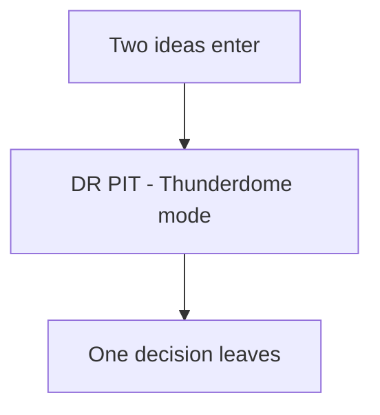

# Diminishing Returns

**Two ideas enter. One decision leaves.**



<details>
<summary>ASCII fallback</summary>

```text
   TWO IDEAS ENTER
        │
        ▼
    ┌─────────┐
    │  DR PIT  │   (Thunderdome mode)
    └────┬────┘
         ▼
   ONE DECISION LEAVES
```

</details>

A small utility for measuring **diminishing returns** in multi-agent / multi-LLM conversations.

This is **not “confidence.”** It’s a stop/ship signal: *are we still producing novel, decision-relevant information?*

---

## 📏 What it measures (v0.1)

A weighted score plus a stop recommendation from observable transcript signals:

- 🧠 **Semantic convergence**: are two agents saying the same thing?
- ✨ **Novelty rate**: are we still generating net-new claims?
- 🧱 **Structural agreement**: are agents modifying each other or just rephrasing?
- 🛠️ **Action readiness**: are we asking more questions or ready to execute?

> Design note: a conversation can converge on the wrong answer. DR measures *diminishing returns*, not truth.

## 🧭 Why

Teams waste cycles in “one more round” loops.

A diminishing-returns meter nudges you toward the next correct move:

- ✅ **name the decision**
- ✅ **assign the next action**
- ✅ **run verification** (tests, reproduce steps, check evidence)

## 🚀 Quick start

```bash
# install
python -m pip install diminishing-returns

# score a transcript
# (see [`spec/transcript.v0.1.schema.json`](./spec/transcript.v0.1.schema.json))
# JSON transcript
dr score transcript.json

# JSONL trace
dr score trace.jsonl
```

## 🧾 Output

```json
{
  "score": 1.0,
  "components": {
    "semantic_similarity": null,
    "novelty_rate": 0.0,
    "structural_agreement": null,
    "action_readiness": 1.0
  },
  "novelty_by_round": [
    {"round": 1, "claims": 4, "new_claims": 4},
    {"round": 2, "claims": 3, "new_claims": 1},
    {"round": 3, "claims": 3, "new_claims": 1},
    {"round": 4, "claims": 3, "new_claims": 1},
    {"round": 5, "claims": 1, "new_claims": 0},
    {"round": 6, "claims": 2, "new_claims": 0}
  ],
  "stop_recommendation": {
    "recommended": true,
    "reason": "k_consecutive_low_novelty",
    "k_required": 2,
    "max_consecutive_low_novelty_rounds": 2,
    "blockers": [],
    "warnings": ["low_claim_volume_recent_rounds"],
    "confidence": 0.75
  },
  "hint": "Diminishing returns detected for consecutive rounds; move to implementation and verification."
}
```

## 🧪 Examples

- [`examples/transcript.meeting-stop.json`](./examples/transcript.meeting-stop.json) — **When to stop a meeting** (universal metaphor)
- [`examples/transcript.ship-of-theseus.json`](./examples/transcript.ship-of-theseus.json) — **Ship of Theseus** (artifact identity / provenance)
- [`examples/transcript.chinese-room.json`](./examples/transcript.chinese-room.json) — **Chinese Room** (define your criterion)

Each example includes a `diminishing_returns_note.recommended_stop_round` to make expected behavior explicit.

## 📎 References (receipts)

If you want the nerdy provenance: see
- [`docs/rubric.md`](./docs/rubric.md) — what DR measures (and why)
- [`docs/references.md`](./docs/references.md) — short annotated bibliography

## License

MIT.
